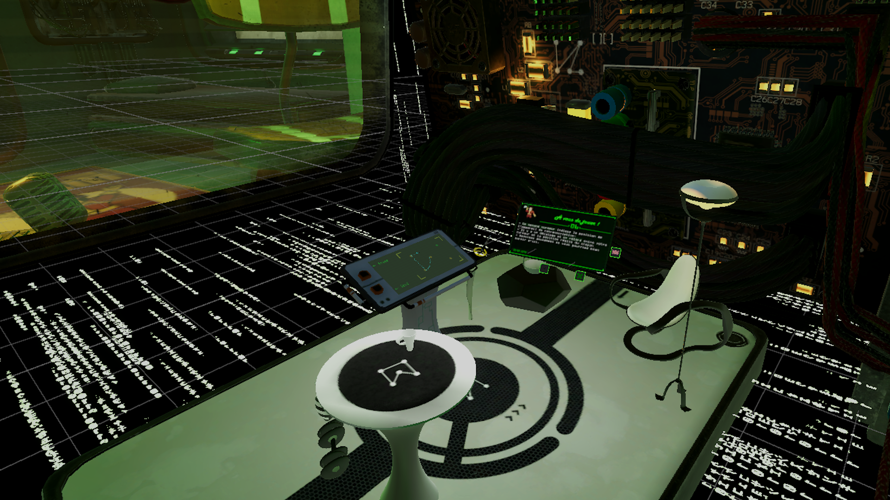

# 🕶️ Atom VR — Dual-Player VR/PC Experience with Novint Falcon Integration

## 📖 Project Overview

Project Atom is a unique two-player virtual reality experience that combines immersive gameplay with vintage haptic technology. This repository contains the **VR application** component, which connects to both a **PC interface application** and a **Novint Falcon driver application** to complete the full interactive setup.

In the game, one player is trapped inside a virtual PC and must communicate with their partner—who uses a simulated PC interface—to find a way out. The only way for the imprisoned player to interact with the real world is through a **Novint Falcon**, a now-obsolete haptic device. Despite its age, the Falcon was successfully revived and repurposed to allow paper-based drawing through force feedback control in VR.

This project was made in roughly 3 weeks by a team of 6 students (during year two of master degree).

## 🖼️ Preview


> _Screenshot of the VR environment showcasing the tablet used to draw._


# 🛠️ Setup & Installation
This experience requires three Unity applications to run simultaneously, all connected via TCP sockets :

+ VR Application (this repository) – the immersive VR experience (also server app for the two others).

+ PC Interface Application – simulates a fake operating system to assist the VR player.

+ Novint Falcon Driver Application – built with an older version of Unity to support the hardware.

As well as drivers and the original interface delivered with the novint falcon (client/server app to controll the device).

# Prerequisites
- Unity 2022.3.10f

- A working VR setup (e.g., Meta Quest, HTC Vive, etc.)

- Novint Falcon (with compatible drivers)

- TCP/IP enabled environment (local or networked)

### Launch Instructions
- Start the Novint Falcon Driver Application.
- Launch the VR Application (this one).
- Launch the Falcon PC application on the same PC (it will automatically connect to the VR application as interface for this app is not required).
- Launch the PC Interface Application and enter the VR app pc IP to connect to it.
- Ensure all apps are correctly connected via the TCP protocol.

## ⚙️ Technologies & Tools

* Unity 2018.4.36f1 (for compatibility with the falcon)
* Unity 2022.3.10f1 (for PC and VR apps)

* C#

* OpenXR

* Custom TCP socket communication

+ Novint Falcon SDK

```markdown
